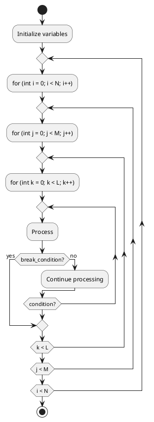

PlantUMLのjarファイルは、Javaで書かれたPlantUMLの実行ファイルです。これを使用することで、PlantUMLのスクリプトからさまざまな形式の図（例えば、PNGやSVG）を生成することができます。このjarファイルは、公式サイトからダウンロードすることができます。

PythonでPlantUMLの図を生成するためには、このjarファイルが必要です。jarファイルを使用することで、PythonからPlantUMLの機能を呼び出して画像を生成することができます。

### PlantUMLのjarファイルの取得方法
1. PlantUMLの公式サイトにアクセスします: [PlantUML公式サイト](http://plantuml.com/download)
2. `plantuml.jar`ファイルをダウンロードします。

### PythonでのPlantUMLの使用方法
PlantUMLのjarファイルを使用して、Pythonから画像を生成するには、以下のような方法があります。

#### 必要なツールのインストール
Python環境でPlantUMLを使用するためには、Javaがインストールされている必要があります。また、Python用のPlantUMLパッケージも使用することができます。

```sh
pip install plantuml
```

#### Pythonスクリプト例

以下は、PlantUMLのjarファイルを使用して、Pythonスクリプトから画像を生成する例です。

```python
import os
import subprocess

def generate_uml_diagrams(input_file):
    # PlantUMLのjarファイルのパスを設定
    plantuml_jar_path = '/path/to/plantuml.jar'  # ダウンロードしたplantuml.jarのパスに変更
    if not os.path.exists(plantuml_jar_path):
        raise FileNotFoundError(f"PlantUML jar file not found: {plantuml_jar_path}")

    # 入力ファイルのディレクトリとファイル名
    input_dir = os.path.dirname(input_file)
    input_filename = os.path.basename(input_file)

    # PNG出力
    png_output_dir = os.path.join(input_dir, 'png')
    if not os.path.exists(png_output_dir):
        os.makedirs(png_output_dir)

    subprocess.run(['java', '-jar', plantuml_jar_path, '-tpng', '-o', png_output_dir, input_file])

    # SVG出力
    svg_output_dir = os.path.join(input_dir, 'svg')
    if not os.path.exists(svg_output_dir):
        os.makedirs(svg_output_dir)

    subprocess.run(['java', '-jar', plantuml_jar_path, '-tsvg', '-o', svg_output_dir, input_file])

if __name__ == "__main__":
    # 入力ファイルのパス
    uml_file = 'path/to/diagram.plantuml'  # 変換したいPlantUMLファイルのパスに変更
    generate_uml_diagrams(uml_file)
```

### PlantUMLのjarファイルを使用しない方法
PlantUMLのjarファイルを使用しない場合、オンラインサービスを使用する方法もありますが、Pythonスクリプトで直接画像を生成する方法としては一般的ではありません。jarファイルを使用する方法が推奨されます。

もしjarファイルを使用せずにオンラインサービスを利用する場合、PlantUMLの公式サーバーにHTTPリクエストを送る方法もありますが、インターネット接続が必要となります。

### 結論
PlantUMLのjarファイルがないと、PythonからローカルでPlantUMLの図を自動的に生成するのは難しいです。jarファイルを使用するのが一般的であり、最も信頼性の高い方法です。したがって、PlantUMLのjarファイルをダウンロードして使用することをお勧めします。

### 3重ループ


