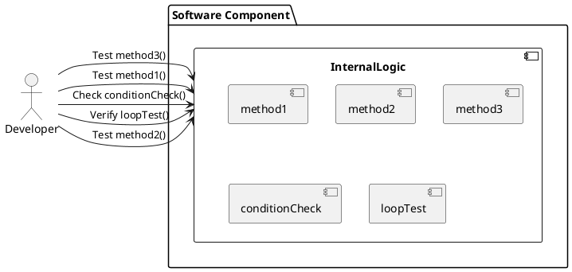
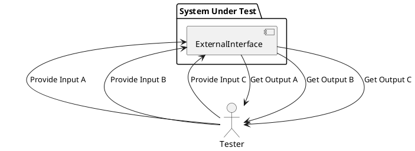
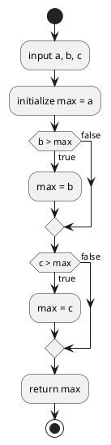

# 1.ホワイトボックステストとブラックボックステスト

## ホワイトボックステスト

**ホワイトボックステスト**は、ソフトウェアの内部構造や動作を確認するテスト手法です。テストケースは、コードの流れや内部のロジックを考慮して設計されます。開発者やテスターはコードを理解し、具体的な関数やメソッドのテストを行います。

### 特徴
1. **内部構造の理解**：テストする人は、ソフトウェアの内部構造（アルゴリズム、ロジック、データフロー）を理解している必要があります。
2. **コードカバレッジ**：テストケースは、できるだけ多くのコードパスや分岐条件をカバーするように設計されます。
3. **デバッグ**：バグやエラーが発見された場合、コードのどの部分が問題を引き起こしているかを特定しやすくなります。

### 実施例
- **ユニットテスト**：個々の関数やメソッドが正しく動作するかを確認します。
- **条件分岐のテスト**：if文やswitch文などの条件分岐が正しく処理されるかを確認します。
- **ループのテスト**：for文やwhile文などのループが正しく動作するかを確認します。

### ホワイトボックステストの具体例
例えば、以下のような単純な関数があったとします：

```cpp
int add(int a, int b) {
    return a + b;
}
```

この関数に対して、ホワイトボックステストでは次のようなテストケースを作成します：
- `add(1, 2)` が `3` を返すことを確認。
- `add(-1, -2)` が `-3` を返すことを確認。
- `add(0, 0)` が `0` を返すことを確認。




## ブラックボックステスト

**ブラックボックステスト**は、ソフトウェアの内部構造を無視し、外部からの入力と出力に焦点を当てるテスト手法です。テストケースは、仕様書や要求定義書に基づいて設計され、システムの外部から観察される挙動を確認します。

### 特徴
1. **内部構造の無視**：テストする人は、ソフトウェアの内部構造を知らなくてもテストが実施できます。
2. **ユーザー視点**：ユーザーが実際にソフトウェアを使用する際の動作を確認することができます。
3. **仕様準拠**：ソフトウェアが仕様通りに動作しているかを確認します。

### 実施例
- **機能テスト**：特定の機能が仕様通りに動作するかを確認します。
- **性能テスト**：システムが要求される性能要件を満たしているかを確認します。
- **ユーザーシナリオテスト**：ユーザーが実際に使用するシナリオに基づいてテストします。

### ブラックボックステストの具体例
例えば、ユーザーがログインフォームにアクセスする場合、次のようなテストケースを作成します：
- 正しいユーザー名とパスワードを入力したときに、ログインが成功することを確認。
- 間違ったユーザー名またはパスワードを入力したときに、エラーメッセージが表示されることを確認。
- ユーザー名やパスワードを空にして送信したときに、エラーメッセージが表示されることを確認。




# C0カバレッジ（ステートメントカバレッジ）の詳細解説

#### 定義

**C0カバレッジ（ステートメントカバレッジ）**は、プログラムのすべてのステートメント（命令）が少なくとも一度は実行されたかを確認するテスト手法です。C0カバレッジは、コード内の各行が実行されたかどうかに注目します。

#### 目的

C0カバレッジの目的は、テストによってコードのすべての部分が一度は実行されることを保証し、未実行の部分を見つけることです。これにより、バグや欠陥が潜在的に存在する部分を明らかにします。

#### 例と詳細な説明

以下のC言語の関数を例に、C0カバレッジを詳しく解説します：

```c
#include <stdio.h>

int findMax(int a, int b, int c) {
    int max = a;  // ステートメント 1

    if (b > max) {  // ステートメント 2
        max = b;    // ステートメント 3
    }

    if (c > max) {  // ステートメント 4
        max = c;    // ステートメント 5
    }

    return max;     // ステートメント 6
}

int main() {
    printf("Max: %d\n", findMax(1, 2, 3)); // ステートメント 7
    printf("Max: %d\n", findMax(3, 2, 1)); // ステートメント 8
    printf("Max: %d\n", findMax(1, 3, 2)); // ステートメント 9
    return 0;                             // ステートメント 10
}
```




#### テストケースとカバレッジの計算
