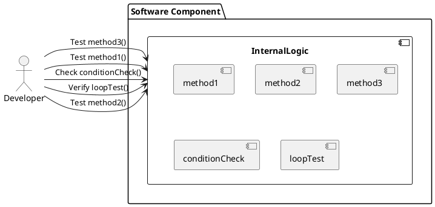

# ホワイトボックステスト

**ホワイトボックステスト**は、ソフトウェアの内部構造や動作を確認するテスト手法です。テストケースは、コードの流れや内部のロジックを考慮して設計されます。開発者やテスターはコードを理解し、具体的な関数やメソッドのテストを行います。

### 工程
ホワイトボックステストは、コードの内部構造やロジックを確認するテストです。このテストは主に以下の工程で実施されます：

1. **ユニットテスト (Unit Testing)**
   - 実装工程の中で実施されます。開発者が自分のコードを細かい単位でテストします。
   - 例えば、関数やメソッドごとにテストを行い、内部ロジックや分岐条件が正しく動作することを確認します。

2. **統合テスト (Integration Testing)**
   - モジュールが組み合わされる段階で実施されます。複数のユニットが一緒に動作することを確認します。
   - ここでもホワイトボックステストが行われ、モジュール間のインターフェースやデータフローが正しいかを確認します。

### 特徴
1. **内部構造の理解**：テストする人は、ソフトウェアの内部構造（アルゴリズム、ロジック、データフロー）を理解している必要があります。
2. **コードカバレッジ**：テストケースは、できるだけ多くのコードパスや分岐条件をカバーするように設計されます。
3. **デバッグ**：バグやエラーが発見された場合、コードのどの部分が問題を引き起こしているかを特定しやすくなります。

### 実施例
- **ユニットテスト**：個々の関数やメソッドが正しく動作するかを確認します。
- **条件分岐のテスト**：if文やswitch文などの条件分岐が正しく処理されるかを確認します。
- **ループのテスト**：for文やwhile文などのループが正しく動作するかを確認します。

### ホワイトボックステストの具体例
例えば、以下のような単純な関数があったとします：

```cpp
int add(int a, int b) {
    return a + b;
}
```

この関数に対して、ホワイトボックステストでは次のようなテストケースを作成します：
- `add(1, 2)` が `3` を返すことを確認。
- `add(-1, -2)` が `-3` を返すことを確認。
- `add(0, 0)` が `0` を返すことを確認。



