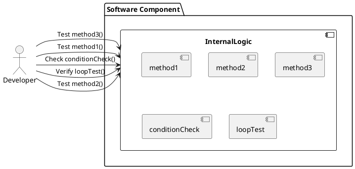
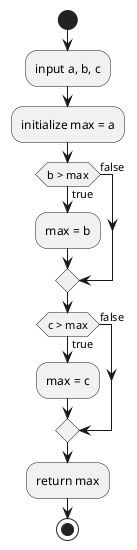

# ホワイトボックステスト

**ホワイトボックステスト**は、ソフトウェアの内部構造や動作を確認するテスト手法です。テストケースは、コードの流れや内部のロジックを考慮して設計されます。開発者やテスターはコードを理解し、具体的な関数やメソッドのテストを行います。

### 工程
ホワイトボックステストは、コードの内部構造やロジックを確認するテストです。このテストは主に以下の工程で実施されます：

1. **ユニットテスト (Unit Testing)**
   - 実装工程の中で実施されます。開発者が自分のコードを細かい単位でテストします。
   - 例えば、関数やメソッドごとにテストを行い、内部ロジックや分岐条件が正しく動作することを確認します。

2. **統合テスト (Integration Testing)**
   - モジュールが組み合わされる段階で実施されます。複数のユニットが一緒に動作することを確認します。
   - ここでもホワイトボックステストが行われ、モジュール間のインターフェースやデータフローが正しいかを確認します。

### 特徴
1. **内部構造の理解**：テストする人は、ソフトウェアの内部構造（アルゴリズム、ロジック、データフロー）を理解している必要があります。
2. **コードカバレッジ**：テストケースは、できるだけ多くのコードパスや分岐条件をカバーするように設計されます。
3. **デバッグ**：バグやエラーが発見された場合、コードのどの部分が問題を引き起こしているかを特定しやすくなります。

### イメージ図




## C0カバレッジ (ステートメントカバレッジ) の詳細解説

#### 定義

C0カバレッジ（ステートメントカバレッジ）は、コード内のすべてのステートメント（命令）が少なくとも一度は実行されるかどうかを確認するテストカバレッジの指標です。C0カバレッジは、各ステートメントが実行されたかどうかを測定します。

#### 目的

C0カバレッジの目的は、テストによってコードのすべての部分が一度は実行されることを保証し、未実行の部分を特定することです。これにより、バグや欠陥が潜在的に存在する部分を明らかにします。

#### テストケース作成の思考法

1. **コードの理解**: テスト対象の関数やメソッドの内部ロジックを理解します。
2. **ステートメントの特定**: 関数内のすべてのステートメントを特定し、各ステートメントが実行されるための条件を確認します。
3. **テストケースの設計**: すべてのステートメントが少なくとも一度は実行されるように、テストケースを設計します。
4. **期待値の設定**: 各テストケースに対して、期待される出力（期待値）を設定します。
5. **実行と検証**: テストケースを実行し、実際の出力が期待値と一致することを確認します。

#### 具体例と詳細な説明

以下に、簡単なC言語の関数を例に、C0カバレッジを詳しく解説します：

```c
#include <stdio.h>

int findMax(int a, int b, int c) {
    int max = a;  // ステートメント 1

    if (b > max) {  // ステートメント 2
        max = b;    // ステートメント 3
    }

    if (c > max) {  // ステートメント 4
        max = c;    // ステートメント 5
    }

    return max;     // ステートメント 6
}

int main() {
    printf("Max: %d\n", findMax(1, 2, 3)); // ステートメント 7
    printf("Max: %d\n", findMax(3, 2, 1)); // ステートメント 8
    printf("Max: %d\n", findMax(1, 3, 2)); // ステートメント 9
    return 0;                             // ステートメント 10
}
```




### 各ステートメントの詳細

上記のコードには、次の10個のステートメントがあります：

1. `int max = a;`
2. `if (b > max)`
3. `max = b;`
4. `if (c > max)`
5. `max = c;`
6. `return max;`
7. `printf("Max: %d\n", findMax(1, 2, 3));`
8. `printf("Max: %d\n", findMax(3, 2, 1));`
9. `printf("Max: %d\n", findMax(1, 3, 2));`
10. `return 0;`

#### テストケースとカバレッジの評価

以下のテストケースを考えます：

1. `findMax(1, 2, 3)`
2. `findMax(3, 2, 1)`
3. `findMax(1, 3, 2)`

これらのテストケースが各ステートメントをどのようにカバーするかを見てみましょう。

- **テストケース1**: `findMax(1, 2, 3)`
  - 実行されるステートメント：1, 2, 3, 4, 5, 6
  - 期待される出力：`3`

- **テストケース2**: `findMax(3, 2, 1)`
  - 実行されるステートメント：1, 2, 4, 6
  - 期待される出力：`3`

- **テストケース3**: `findMax(1, 3, 2)`
  - 実行されるステートメント：1, 2, 3, 4, 6
  - 期待される出力：`3`

ステートメント7, 8, 9, 10は`main`関数内のコードに含まれるため、`main`関数が実行される限り常にカバーされます。

#### カバレッジの評価

すべてのテストケースを実行した場合、以下のようにすべてのステートメントが少なくとも一度は実行されることが確認できます。

- ステートメント1：すべてのテストケースで実行
- ステートメント2：すべてのテストケースで実行
- ステートメント3：テストケース1とテストケース3で実行
- ステートメント4：すべてのテストケースで実行
- ステートメント5：テストケース1で実行
- ステートメント6：すべてのテストケースで実行
- ステートメント7, 8, 9：`main`で実行
- ステートメント10：`main`で実行

これにより、C0カバレッジは100%になります。

### 表形式によるテストケースの入力と期待値

以下に、`findMax`関数のテストケースを表形式で示します：

| テストケース | 入力値 (a, b, c) | 期待値 (max) | 説明 |
|--------------|------------------|-------------|------|
| TC1          | (1, 2, 3)        | 3           | すべてのステートメントが実行される。`b > max`と`c > max`がtrue。 |
| TC2          | (3, 2, 1)        | 3           | `b > max`と`c > max`がfalse。 |
| TC3          | (1, 3, 2)        | 3           | `b > max`がtrue、`c > max`がfalse。 |

### まとめ

- **C0カバレッジ**は、コード内のすべてのステートメントが少なくとも一度は実行されるかを確認する指標です。
- **目的**は、テストによってコードのすべての部分が一度は実行されることを保証し、未実行の部分を特定することです。
- **テストケースの設計**により、すべてのステートメントが少なくとも一度は実行されるようにします。

## C1カバレッジ (分岐カバレッジ) の詳細解説

#### 定義

C1カバレッジ（分岐カバレッジ）は、コード内のすべての分岐（条件文）がtrueとfalseの両方で少なくとも一度は評価されるかを確認するテストカバレッジの指標です。C1カバレッジは、各分岐が両方の結果で実行されることを測定します。

#### 目的

C1カバレッジの目的は、すべての分岐条件が正しく評価されることを保証し、分岐ごとの全ての可能性をテストすることです。これにより、条件文に関する潜在的なバグや欠陥を明らかにします。

#### テストケース作成の思考法

1. **コードの理解**: テスト対象の関数やメソッドの内部ロジックを理解し、分岐条件を特定します。
2. **分岐の特定**: 関数内のすべての分岐条件を特定し、各分岐条件がtrueとfalseの両方で評価されるようにテストケースを設計します。
3. **テストケースの設計**: 各分岐条件がtrueの場合とfalseの場合の両方をテストするケースを設計します。
4. **期待値の設定**: 各テストケースに対して、期待される出力（期待値）を設定します。
5. **実行と検証**: テストケースを実行し、実際の出力が期待値と一致することを確認します。

#### 具体例と詳細な説明

以下に、簡単なC言語の関数を例に、C1カバレッジを詳しく解説します：

```c
#include <stdio.h>

int findMax(int a, int b, int c) {
    int max = a;  // ステートメント 1

    if (b > max) {  // ステートメント 2
        max = b;    // ステートメント 3
    }

    if (c > max) {  // ステートメント 4
        max = c;    // ステートメント 5
    }

    return max;     // ステートメント 6
}

int main() {
    printf("Max: %d\n", findMax(1, 2, 3)); // ステートメント 7
    printf("Max: %d\n", findMax(3, 2, 1)); // ステートメント 8
    printf("Max: %d\n", findMax(1, 3, 2)); // ステートメント 9
    return 0;                             // ステートメント 10
}
```

### C1カバレッジを達成するためのテストケース

以下のテストケースを考えます：

1. `findMax(1, 2, 3)` - `b > max`がtrue、`c > max`がtrue
2. `findMax(3, 2, 1)` - `b > max`がfalse、`c > max`がfalse
3. `findMax(1, 3, 2)` - `b > max`がtrue、`c > max`がfalse
4. `findMax(3, 1, 2)` - `b > max`がfalse、`c > max`がtrue

#### テストケースとカバレッジの評価

- **テストケース1**: `findMax(1, 2, 3)`
  - 実行されるステートメント：1, 2, 3, 4, 5, 6
  - 期待される出力：`3`

- **テストケース2**: `findMax(3, 2, 1)`
  - 実行されるステートメント：1, 2, 4, 6
  - 期待される出力：`3`

- **テストケース3**: `findMax(1, 3, 2)`
  - 実行されるステートメント：1, 2, 3, 4, 6
  - 期待される出力：`3`

- **テストケース4**: `findMax(3, 1, 2)`
  - 実行されるステートメント：1, 2, 4, 5, 6
  - 期待される出力：`3`

### C1カバレッジ達成のための条件

すべてのテストケースを実行した場合、以下のようにすべての分岐条件がtrueとfalseの両方で評価されることが確認できます。

- ステートメント1：すべてのテストケースで実行
- ステートメント2：テストケース1とテストケース3でtrue、テストケース2とテストケース4でfalse
- ステートメント3：テストケース1とテストケース3で実行
- ステートメント4：テストケース1とテストケース4でtrue、テストケース2とテストケース3でfalse
- ステートメント5：テストケース1とテストケース4で実行
- ステートメント6：すべてのテストケースで実行

これにより、C1カバレッジは100%になります。

### 表形式によるテストケースの入力と期待値

以下に、`findMax`関数のテストケースを表形式で示します：

| テストケース | 入力値 (a, b, c) | 期待値 (max) | 分岐条件の評価 |
|--------------|------------------|-------------|---------------|
| TC1          | (1, 2, 3)        | 3           | `b > max` = true、`c > max` = true |
| TC2          | (3, 2, 1)        | 3           | `b > max` = false、`c > max` = false |
| TC3          | (1, 3, 2)        | 3           | `b > max` = true、`c > max` = false |
| TC4          | (3, 1, 2)        | 3           | `b > max` = false、`c > max` = true |

### C0カバレッジとの違いや関係性

#### C0カバレッジとの違い

- **C0カバレッジ（ステートメントカバレッジ）**は、すべてのステートメントが少なくとも一度は実行されるかを確認する指標です。
  - 例: 各ステートメントが一度でも実行されれば、C0カバレッジは達成されます。
- **C1カバレッジ（分岐カバレッジ）**は、すべての分岐条件がtrueとfalseの両方で少なくとも一度は評価されるかを確認する指標です。
  - 例: 分岐条件がtrueの場合とfalseの場合の両方で評価されなければ、C1カバレッジは達成されません。

#### 関係性

- **補完的な関係**: C0カバレッジはステートメントレベルでのカバレッジを提供し、C1カバレッジは分岐レベルでのカバレッジを提供します。これにより、コードの完全なカバレッジを達成するためには両方のカバレッジを考慮する必要があります。
- **段階的な評価**: C0カバレッジは基本的なカバレッジ指標であり、C1カバレッジはその上位の指標です。すべてのステートメントが実行されても、すべての分岐条件が両方の結果で評価されるわけではありません。

### まとめ

- **C1カバレッジ**は、コード内のすべての分岐条件がtrueとfalseの両方で評価されるかを確認する指標です。
- **目的**は、分岐条件が正しく評価され、全ての可能性をテストすることです。
- **テストケースの設計**により、すべての分岐条件が少なくとも一度はtrueとfalseで評価されるようにします。
- **C0カバレッジとの関係性**: C0カバレッジはステートメントレベルのカバレッジを提供し、C1カバレッジは分岐レベルのカバレッジを提供します。両者は補完的な関係にあります。
