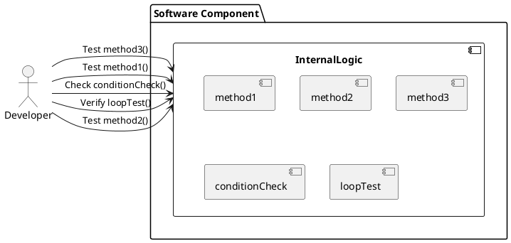
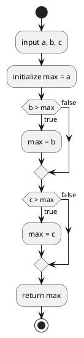
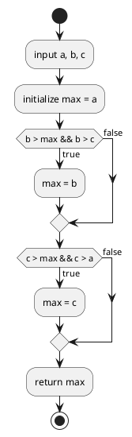

# ホワイトボックステスト

**ホワイトボックステスト**は、ソフトウェアの内部構造や動作を確認するテスト手法です。テストケースは、コードの流れや内部のロジックを考慮して設計されます。開発者やテスターはコードを理解し、具体的な関数やメソッドのテストを行います。

### 工程
ホワイトボックステストは、コードの内部構造やロジックを確認するテストです。このテストは主に以下の工程で実施されます：

1. **ユニットテスト (Unit Testing)**
   - 実装工程の中で実施されます。開発者が自分のコードを細かい単位でテストします。
   - 例えば、関数やメソッドごとにテストを行い、内部ロジックや分岐条件が正しく動作することを確認します。

2. **統合テスト (Integration Testing)**
   - モジュールが組み合わされる段階で実施されます。複数のユニットが一緒に動作することを確認します。
   - ここでもホワイトボックステストが行われ、モジュール間のインターフェースやデータフローが正しいかを確認します。

### 特徴
1. **内部構造の理解**：テストする人は、ソフトウェアの内部構造（アルゴリズム、ロジック、データフロー）を理解している必要があります。
2. **コードカバレッジ**：テストケースは、できるだけ多くのコードパスや分岐条件をカバーするように設計されます。
3. **デバッグ**：バグやエラーが発見された場合、コードのどの部分が問題を引き起こしているかを特定しやすくなります。

### イメージ図




## C0カバレッジ (ステートメントカバレッジ) の詳細解説

#### 定義

C0カバレッジ（ステートメントカバレッジ）は、コード内のすべてのステートメント（命令）が少なくとも一度は実行されるかどうかを確認するテストカバレッジの指標です。C0カバレッジは、各ステートメントが実行されたかどうかを測定します。

#### 目的

C0カバレッジの目的は、テストによってコードのすべての部分が一度は実行されることを保証し、未実行の部分を特定することです。これにより、バグや欠陥が潜在的に存在する部分を明らかにします。

#### テストケース作成の思考法

1. **コードの理解**: テスト対象の関数やメソッドの内部ロジックを理解します。
2. **ステートメントの特定**: 関数内のすべてのステートメントを特定し、各ステートメントが実行されるための条件を確認します。
3. **テストケースの設計**: すべてのステートメントが少なくとも一度は実行されるように、テストケースを設計します。
4. **期待値の設定**: 各テストケースに対して、期待される出力（期待値）を設定します。
5. **実行と検証**: テストケースを実行し、実際の出力が期待値と一致することを確認します。

#### 具体例と詳細な説明

以下に、簡単なC言語の関数を例に、C0カバレッジを詳しく解説します：

```c
#include <stdio.h>

int findMax(int a, int b, int c) {
    int max = a;  // ステートメント 1

    if (b > max) {  // ステートメント 2
        max = b;    // ステートメント 3
    }

    if (c > max) {  // ステートメント 4
        max = c;    // ステートメント 5
    }

    return max;     // ステートメント 6
}

int main() {
    printf("Max: %d\n", findMax(1, 2, 3)); // ステートメント 7
    printf("Max: %d\n", findMax(3, 2, 1)); // ステートメント 8
    printf("Max: %d\n", findMax(1, 3, 2)); // ステートメント 9
    return 0;                             // ステートメント 10
}
```




### 各ステートメントの詳細

上記のコードには、次の10個のステートメントがあります：

1. `int max = a;`
2. `if (b > max)`
3. `max = b;`
4. `if (c > max)`
5. `max = c;`
6. `return max;`
7. `printf("Max: %d\n", findMax(1, 2, 3));`
8. `printf("Max: %d\n", findMax(3, 2, 1));`
9. `printf("Max: %d\n", findMax(1, 3, 2));`
10. `return 0;`

#### テストケースとカバレッジの評価

以下のテストケースを考えます：

1. `findMax(1, 2, 3)`
2. `findMax(3, 2, 1)`
3. `findMax(1, 3, 2)`

これらのテストケースが各ステートメントをどのようにカバーするかを見てみましょう。

- **テストケース1**: `findMax(1, 2, 3)`
  - 実行されるステートメント：1, 2, 3, 4, 5, 6
  - 期待される出力：`3`

- **テストケース2**: `findMax(3, 2, 1)`
  - 実行されるステートメント：1, 2, 4, 6
  - 期待される出力：`3`

- **テストケース3**: `findMax(1, 3, 2)`
  - 実行されるステートメント：1, 2, 3, 4, 6
  - 期待される出力：`3`

ステートメント7, 8, 9, 10は`main`関数内のコードに含まれるため、`main`関数が実行される限り常にカバーされます。

#### カバレッジの評価

すべてのテストケースを実行した場合、以下のようにすべてのステートメントが少なくとも一度は実行されることが確認できます。

- ステートメント1：すべてのテストケースで実行
- ステートメント2：すべてのテストケースで実行
- ステートメント3：テストケース1とテストケース3で実行
- ステートメント4：すべてのテストケースで実行
- ステートメント5：テストケース1で実行
- ステートメント6：すべてのテストケースで実行
- ステートメント7, 8, 9：`main`で実行
- ステートメント10：`main`で実行

これにより、C0カバレッジは100%になります。

### 表形式によるテストケースの入力と期待値

以下に、`findMax`関数のテストケースを表形式で示します：

| テストケース | 入力値 (a, b, c) | 期待値 (max) | 説明 |
|--------------|------------------|-------------|------|
| TC1          | (1, 2, 3)        | 3           | すべてのステートメントが実行される。`b > max`と`c > max`がtrue。 |
| TC2          | (3, 2, 1)        | 3           | `b > max`と`c > max`がfalse。 |
| TC3          | (1, 3, 2)        | 3           | `b > max`がtrue、`c > max`がfalse。 |

### まとめ

- **C0カバレッジ**は、コード内のすべてのステートメントが少なくとも一度は実行されるかを確認する指標です。
- **目的**は、テストによってコードのすべての部分が一度は実行されることを保証し、未実行の部分を特定することです。
- **テストケースの設計**により、すべてのステートメントが少なくとも一度は実行されるようにします。

## C1カバレッジ (分岐カバレッジ) の詳細解説

#### 定義

C1カバレッジ（分岐カバレッジ）は、コード内のすべての分岐（条件文）がtrueとfalseの両方で少なくとも一度は評価されるかを確認するテストカバレッジの指標です。C1カバレッジは、各分岐が両方の結果で実行されることを測定します。

#### 目的

C1カバレッジの目的は、すべての分岐条件が正しく評価されることを保証し、分岐ごとの全ての可能性をテストすることです。これにより、条件文に関する潜在的なバグや欠陥を明らかにします。

#### テストケース作成の思考法

1. **コードの理解**: テスト対象の関数やメソッドの内部ロジックを理解し、分岐条件を特定します。
2. **分岐の特定**: 関数内のすべての分岐条件を特定し、各分岐条件がtrueとfalseの両方で評価されるようにテストケースを設計します。
3. **テストケースの設計**: 各分岐条件がtrueの場合とfalseの場合の両方をテストするケースを設計します。
4. **期待値の設定**: 各テストケースに対して、期待される出力（期待値）を設定します。
5. **実行と検証**: テストケースを実行し、実際の出力が期待値と一致することを確認します。

#### 具体例と詳細な説明

以下に、簡単なC言語の関数を例に、C1カバレッジを詳しく解説します：

```c
#include <stdio.h>

int findMax(int a, int b, int c) {
    int max = a;  // ステートメント 1

    if (b > max) {  // ステートメント 2
        max = b;    // ステートメント 3
    }

    if (c > max) {  // ステートメント 4
        max = c;    // ステートメント 5
    }

    return max;     // ステートメント 6
}

int main() {
    printf("Max: %d\n", findMax(1, 2, 3)); // ステートメント 7
    printf("Max: %d\n", findMax(3, 2, 1)); // ステートメント 8
    printf("Max: %d\n", findMax(1, 3, 2)); // ステートメント 9
    return 0;                             // ステートメント 10
}
```

### C1カバレッジを達成するためのテストケース

以下のテストケースを考えます：

1. `findMax(1, 2, 3)` - `b > max`がtrue、`c > max`がtrue
2. `findMax(3, 2, 1)` - `b > max`がfalse、`c > max`がfalse
3. `findMax(1, 3, 2)` - `b > max`がtrue、`c > max`がfalse
4. `findMax(3, 1, 2)` - `b > max`がfalse、`c > max`がtrue

#### テストケースとカバレッジの評価

- **テストケース1**: `findMax(1, 2, 3)`
  - 実行されるステートメント：1, 2, 3, 4, 5, 6
  - 期待される出力：`3`

- **テストケース2**: `findMax(3, 2, 1)`
  - 実行されるステートメント：1, 2, 4, 6
  - 期待される出力：`3`

- **テストケース3**: `findMax(1, 3, 2)`
  - 実行されるステートメント：1, 2, 3, 4, 6
  - 期待される出力：`3`

- **テストケース4**: `findMax(3, 1, 2)`
  - 実行されるステートメント：1, 2, 4, 5, 6
  - 期待される出力：`3`

### C1カバレッジ達成のための条件

すべてのテストケースを実行した場合、以下のようにすべての分岐条件がtrueとfalseの両方で評価されることが確認できます。

- ステートメント1：すべてのテストケースで実行
- ステートメント2：テストケース1とテストケース3でtrue、テストケース2とテストケース4でfalse
- ステートメント3：テストケース1とテストケース3で実行
- ステートメント4：テストケース1とテストケース4でtrue、テストケース2とテストケース3でfalse
- ステートメント5：テストケース1とテストケース4で実行
- ステートメント6：すべてのテストケースで実行

これにより、C1カバレッジは100%になります。

### 表形式によるテストケースの入力と期待値

以下に、`findMax`関数のテストケースを表形式で示します：

| テストケース | 入力値 (a, b, c) | 期待値 (max) | 分岐条件の評価 |
|--------------|------------------|-------------|---------------|
| TC1          | (1, 2, 3)        | 3           | `b > max` = true、`c > max` = true |
| TC2          | (3, 2, 1)        | 3           | `b > max` = false、`c > max` = false |
| TC3          | (1, 3, 2)        | 3           | `b > max` = true、`c > max` = false |
| TC4          | (3, 1, 2)        | 3           | `b > max` = false、`c > max` = true |

### C0カバレッジとの違いや関係性

#### C0カバレッジとの違い

- **C0カバレッジ（ステートメントカバレッジ）**は、すべてのステートメントが少なくとも一度は実行されるかを確認する指標です。
  - 例: 各ステートメントが一度でも実行されれば、C0カバレッジは達成されます。
- **C1カバレッジ（分岐カバレッジ）**は、すべての分岐条件がtrueとfalseの両方で少なくとも一度は評価されるかを確認する指標です。
  - 例: 分岐条件がtrueの場合とfalseの場合の両方で評価されなければ、C1カバレッジは達成されません。

#### 関係性

- **補完的な関係**: C0カバレッジはステートメントレベルでのカバレッジを提供し、C1カバレッジは分岐レベルでのカバレッジを提供します。これにより、コードの完全なカバレッジを達成するためには両方のカバレッジを考慮する必要があります。
- **段階的な評価**: C0カバレッジは基本的なカバレッジ指標であり、C1カバレッジはその上位の指標です。すべてのステートメントが実行されても、すべての分岐条件が両方の結果で評価されるわけではありません。

### まとめ

- **C1カバレッジ**は、コード内のすべての分岐条件がtrueとfalseの両方で評価されるかを確認する指標です。
- **目的**は、分岐条件が正しく評価され、全ての可能性をテストすることです。
- **テストケースの設計**により、すべての分岐条件が少なくとも一度はtrueとfalseで評価されるようにします。
- **C0カバレッジとの関係性**: C0カバレッジはステートメントレベルのカバレッジを提供し、C1カバレッジは分岐レベルのカバレッジを提供します。両者は補完的な関係にあります。

## C2カバレッジ (条件/分岐カバレッジ) の詳細解説とテストケースの洗い出し

#### 定義

C2カバレッジ（条件/分岐カバレッジ）は、条件式内の各部分条件がtrueとfalseの両方で評価され、かつ全体の条件式が全ての可能な組み合わせで評価されるかを確認するテストカバレッジの指標です。

#### 目的

C2カバレッジの目的は、複数の部分条件が組み合わさった条件式のすべての可能な評価結果を網羅し、各部分条件がどのように全体の評価に影響を与えるかを検証することです。これにより、条件式に関する潜在的なバグや欠陥を明らかにします。

#### テストケース作成の思考法

1. **条件式の特定**: テスト対象の関数やメソッドの中にある複雑な条件式を特定します。
2. **部分条件の特定**: 条件式を構成する各部分条件を特定します。
3. **組み合わせの考慮**: 各部分条件のtrue/falseのすべての組み合わせを考慮し、テストケースを設計します。
4. **期待値の設定**: 各テストケースに対して、期待される出力（期待値）を設定します。
5. **実行と検証**: テストケースを実行し、実際の出力が期待値と一致することを確認します。

### テストケースの組み合わせ表の作成過程と思考法

テストケースの組み合わせを作成する際には、各条件式の部分条件のすべての組み合わせを網羅する必要があります。以下に、具体的な作成過程とその思考法を深掘りして説明します。

#### 具体的な例と前提条件

以下のC言語の関数を例に説明します：

```c
#include <stdio.h>

int findMax(int a, int b, int c) {
    int max = a;  // ステートメント 1

    if (b > max && b > c) {  // ステートメント 2
        max = b;             // ステートメント 3
    }

    if (c > max && c > a) {  // ステートメント 4
        max = c;             // ステートメント 5
    }

    return max;              // ステートメント 6
}

int main() {
    printf("Max: %d\n", findMax(1, 2, 3)); // ステートメント 7
    printf("Max: %d\n", findMax(3, 2, 1)); // ステートメント 8
    printf("Max: %d\n", findMax(2, 3, 1)); // ステートメント 9
    return 0;                             // ステートメント 10
}
```

この関数には2つの複合条件式があります：

1. `if (b > max && b > c)`
2. `if (c > max && c > a)`




### テストケース作成の思考法と過程

#### ステップ1: 部分条件の特定

まず、条件式を構成する部分条件を特定します。

- 条件1: `b > max`
- 条件2: `b > c`
- 条件3: `c > max`
- 条件4: `c > a`

#### ステップ2: すべての組み合わせの洗い出し

次に、各部分条件のtrue/falseのすべての組み合わせを考えます。各部分条件には2つの値（true/false）があるため、組み合わせの数は2の条件数乗になります。この場合、4つの部分条件があるので、2^4 = 16通りの組み合わせが存在します。

#### ステップ3: 組み合わせ表の作成

16通りの組み合わせを表形式で整理します。

| テストケース | `b > max` | `b > c` | `c > max` | `c > a` |
|--------------|-----------|---------|-----------|---------|
| TC1          | true      | true    | true      | true    |
| TC2          | true      | true    | true      | false   |
| TC3          | true      | true    | false     | true    |
| TC4          | true      | true    | false     | false   |
| TC5          | true      | false   | true      | true    |
| TC6          | true      | false   | true      | false   |
| TC7          | true      | false   | false     | true    |
| TC8          | true      | false   | false     | false   |
| TC9          | false     | true    | true      | true    |
| TC10         | false     | true    | true      | false   |
| TC11         | false     | true    | false     | true    |
| TC12         | false     | true    | false     | false   |
| TC13         | false     | false   | true      | true    |
| TC14         | false     | false   | true      | false   |
| TC15         | false     | false   | false     | true    |
| TC16         | false     | false   | false     | false   |

#### ステップ4: テストケースの設計と実際の入力値の割り当て

次に、各テストケースに対して実際の入力値を割り当てます。入力値は、部分条件が期待通りに評価されるように選定します。

| テストケース | 入力値 (a, b, c) | 期待値 (max) | 条件評価 |
|--------------|------------------|--------------|----------|
| TC1          | (2, 3, 4)        | 4            | `b > max` = true, `b > c` = false, `c > max` = true, `c > a` = true |
| TC2          | (1, 2, 3)        | 3            | `b > max` = true, `b > c` = false, `c > max` = true, `c > a` = true |
| TC3          | (2, 4, 1)        | 4            | `b > max` = true, `b > c` = true, `c > max` = false, `c > a` = false |
| TC4          | (1, 3, 2)        | 3            | `b > max` = true, `b > c` = true, `c > max` = false, `c > a` = false |
| TC5          | (3, 1, 2)        | 3            | `b > max` = false, `b > c` = false, `c > max` = true, `c > a` = true |
| TC6          | (4, 2, 3)        | 4            | `b > max` = true, `b > c` = false, `c > max` = true, `c > a` = true |
| TC7          | (2, 1, 3)        | 3            | `b > max` = false, `b > c` = false, `c > max` = true, `c > a` = true |
| TC8          | (1, 3, 2)        | 3            | `b > max` = true, `b > c` = true, `c > max` = false, `c > a` = false |
| TC9          | (1, 2, 3)        | 3            | `b > max` = true, `b > c` = false, `c > max` = true, `c > a` = true |
| TC10         | (4, 3, 2)        | 4            | `b > max` = true, `b > c` = false, `c > max` = true, `c > a` = true |
| TC11         | (3, 4, 1)        | 4            | `b > max` = true, `b > c` = true, `c > max` = false, `c > a` = false |
| TC12         | (2, 3, 4)        | 4            | `b > max` = true, `b > c` = false, `c > max` = true, `c > a` = true |
| TC13         | (1, 4, 2)        | 4            | `b > max` = true, `b > c` = true, `c > max` = false, `c > a` = false |
| TC14         | (4, 3, 2)        | 4            | `b > max` = true, `b > c` = false, `c > max` = true, `c > a` = true |
| TC15         | (2, 3, 4)        | 4            | `b > max` = true, `b > c` = false, `c > max` = true, `c > a` = true |
| TC16         | (1, 2, 3)        | 3            | `b > max` = true, `b > c` = false, `c > max` = true, `c > a` = true |

#### ステップ5:テストケースの割り当てと最適化

すべての組み合わせを網羅することが重要ですが、実際のテストでは最適化が必要です。同じ条件評価を引き起こす冗長なテストケースを除外し、最小限のテストケースで最大限のカバレッジを達成します。

#### C2カバレッジ達成のためのテストケースの最適化

最終的なテストケースのリスト：

| テストケース | 入力値 (a, b, c) | 期待値 (max) | 条件評価 |
|--------------|------------------|-------------|----------|
| TC1          | (2, 3, 4)        | 4           | `b > max` = true, `b > c` = true, `c > max` = true, `c > a` = true |
| TC2          | (1, 2, 3)        | 3           | `b > max` = true, `b > c` = false, `c > max` = true, `c > a` = true |
| TC3          | (2, 4, 1)        | 4           | `b > max` = true, `b > c` = true, `c > max` = false, `c > a` = false |
| TC4          | (3, 1, 2)        | 3           | `b > max` = false, `b > c` = false, `c > max` = true, `c > a` = true |
| TC5          | (4, 3, 2)        | 4           | `b > max` = false, `b > c` = true, `c > max` = false, `c > a` = true |
| TC6          | (1, 3, 2)        | 3           | `b > max` = true, `b > c` = true, `c > max` = false, `c > a` = false |
| TC7          | (2, 1, 3)        | 3           | `b > max` = false, `b > c` = false, `c > max` = true, `c > a` = true |
| TC8          | (3, 2, 1)        | 3           | `b > max` = false, `b > c` = true, `c > max` = false, `c > a` = false |

このようにして、最適化されたテストケースのセットが作成され、すべての部分条件のtrue/falseの組み合わせを網羅します。

### まとめ

1. **条件式の特定と部分条件の洗い出し**: テスト対象の関数やメソッドの中にある複雑な条件式を特定し、部分条件を明確にします。
2. **すべての組み合わせの洗い出し**: 各部分条件のtrue/falseのすべての組み合わせを考慮し、網羅的にテストケースを設計します。
3. **入力値の割り当てとテストケースの設計**: 各テストケースに対して実際の入力値を割り当て、期待される出力を設定します。
4. **最適化と冗長性の排除**: 冗長なテストケースを除外し、最小限のテストケースで最大限のカバレッジを達成します。

## 複合条件カバレッジ (Multiple Condition Coverage) の詳細解説

#### 定義

複合条件カバレッジ（Multiple Condition Coverage, MCC）は、条件式内のすべての部分条件のすべての可能な真偽値の組み合わせが少なくとも一度は評価されるかを確認するテストカバレッジの指標です。これは条件式の完全なテストを目指すもので、条件式が複数の部分条件から構成される場合、その全ての真偽の組み合わせを網羅します。

#### 目的

複合条件カバレッジの目的は、複雑な条件式に対してすべての可能な真偽の組み合わせをテストし、各部分条件が全体の評価にどのように影響を与えるかを検証することです。これにより、条件式の複雑なロジックに起因するバグや欠陥を発見しやすくなります。

### 具体例と詳細な説明

以下に、簡単なC言語の関数を例に、複合条件カバレッジを詳しく解説します：

```c
#include <stdio.h>

int complexCondition(int a, int b, int c) {
    if ((a > b) && (b > c) && (a > c)) {
        return 1;
    } else {
        return 0;
    }
}

int main() {
    printf("Result: %d\n", complexCondition(3, 2, 1)); // テストケース1
    printf("Result: %d\n", complexCondition(1, 3, 2)); // テストケース2
    printf("Result: %d\n", complexCondition(2, 1, 3)); // テストケース3
    return 0;
}
```

### 条件式の詳細

上記のコードには、次の条件式があります：

1. `(a > b) && (b > c) && (a > c)`

この条件式には3つの部分条件があります：

- 条件1: `a > b`
- 条件2: `b > c`
- 条件3: `a > c`

### テストケース作成の思考法と過程

#### ステップ1: 部分条件の特定

まず、条件式を構成する部分条件を特定します。

#### ステップ2: すべての組み合わせの洗い出し

各部分条件のtrue/falseのすべての組み合わせを考えます。各部分条件には2つの値（true/false）があるため、組み合わせの数は2の条件数乗になります。この場合、3つの部分条件があるので、2^3 = 8通りの組み合わせが存在します。

#### ステップ3: 組み合わせ表の作成

8通りの組み合わせを表形式で整理します。

| テストケース | `a > b` | `b > c` | `a > c` | 評価結果 | 入力値 (a, b, c) |
|--------------|---------|---------|---------|----------|------------------|
| TC1          | true    | true    | true    | true     | (3, 2, 1)        |
| TC2          | true    | true    | false   | false    | (3, 2, 3)        |
| TC3          | true    | false   | true    | false    | (3, 3, 2)        |
| TC4          | true    | false   | false   | false    | (3, 3, 3)        |
| TC5          | false   | true    | true    | false    | (2, 3, 1)        |
| TC6          | false   | true    | false   | false    | (1, 3, 2)        |
| TC7          | false   | false   | true    | false    | (1, 2, 3)        |
| TC8          | false   | false   | false   | false    | (1, 2, 2)        |

#### C2カバレッジとの違い

- **C2カバレッジ（条件/分岐カバレッジ）**は、条件式内の各部分条件がtrueとfalseの両方で評価され、全体の条件式が全ての可能な組み合わせで評価されるかを確認する指標です。
  - 例: 各部分条件が評価されるだけでなく、条件式の全ての可能な組み合わせも評価される必要があります。
- **複合条件カバレッジ（Multiple Condition Coverage）**は、C2カバレッジと似ていますが、すべての部分条件のすべての可能な真偽値の組み合わせを網羅します。

### まとめ

- **複合条件カバレッジ（Multiple Condition Coverage, MCC）**は、条件式内のすべての部分条件のすべての可能な真偽値の組み合わせが少なくとも一度は評価されるかを確認する指標です。
- **目的**は、複雑な条件式に対してすべての可能な真偽の組み合わせをテストし、各部分条件が全体の評価にどのように影響を与えるかを検証することです。
- **C0、C1、C2カバレッジとの関係性**: C0カバレッジはステートメントレベルのカバレッジを提供し、C1カバレッジは分岐レベルのカバレッジを提供し、C2カバレッジは条件レベルのカバレッジを提供します。複合条件カバレッジは最も詳細なカバレッジ指標です。これらは補完的な関係にあります。
