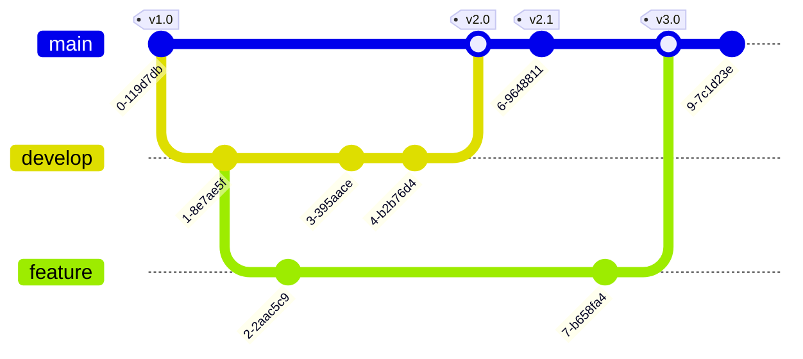
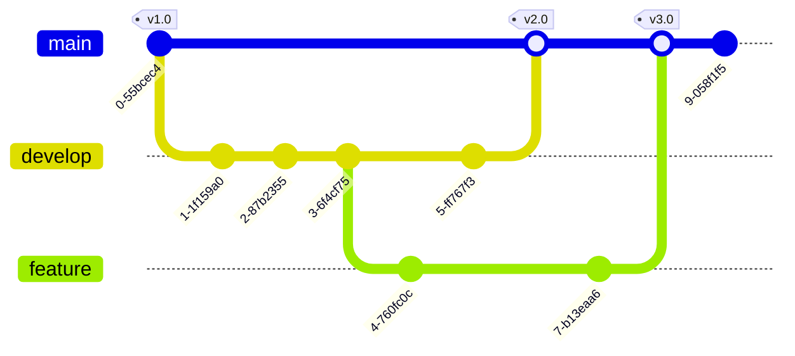

Gitの**submodule**は、あるGitリポジトリの中に「別のGitリポジトリ」を組み込むための仕組みです。これにより、大きなプロジェクトの中で、外部のライブラリやコンポーネントを独立したリポジトリとして管理しながら、自分のプロジェクトに取り込むことができます。以下、初心者向けに分かりやすく解説します。

---

## 1. Submoduleの基本的な考え方

- **独立した管理**  
  Submoduleとして取り込んだリポジトリは、メインのプロジェクトとは別個のリポジトリとして管理されます。つまり、ライブラリや外部コンポーネントを更新する際、その履歴は独立して保持され、メインリポジトリには「特定のコミットを指すポインタ」として記録されます。

- **固定したバージョンの利用**  
  メインのリポジトリは、Submoduleの特定のコミット（＝バージョン）を参照するため、予期せぬ更新がプロジェクト全体に影響しないようにできます。必要に応じて、Submoduleの更新を取り込むかどうかを選択できます。

---

## 2. Submoduleの仕組みと管理方法

### a. `.gitmodules` ファイル
Submoduleを追加すると、プロジェクトのルートに **`.gitmodules`** という設定ファイルが作成されます。このファイルには、以下の情報が記録されます。

- **パス**: Submoduleが配置されるディレクトリ
- **URL**: 取り込むリポジトリのリモートURL

たとえば、以下のような内容になります。

```ini
[submodule "libs/sample-library"]
    path = libs/sample-library
    url = https://github.com/example/sample-library.git
```

### b. Submoduleの追加方法
Submoduleをプロジェクトに追加するには、以下のコマンドを使います。

```bash
git submodule add <リポジトリのURL> <配置するパス>
```

例:
```bash
git submodule add https://github.com/example/sample-library.git libs/sample-library
```

このコマンドを実行すると、
- 指定したURLのリポジトリが `libs/sample-library` にクローンされる
- `.gitmodules` ファイルが作成（または更新）される
- メインリポジトリは、`libs/sample-library` の特定のコミットを参照するポインタを記録する

### c. Submoduleの更新とコミット
Submodule内で変更を加えた場合は、通常のGitリポジトリと同様に**コミット**します。しかし、メインのリポジトリは「Submoduleのどのコミットを参照しているか」という情報のみを持っているため、Submodule側で変更後、その最新状態をメインリポジトリに反映させるためには、**Submoduleの参照更新**（ポインタの更新）を行い、それをコミットする必要があります。

1. Submodule内で変更し、コミットする
2. メインリポジトリに戻り、Submoduleの状態が更新されたことを確認する（`git status` で表示される）
3. その状態（新しいコミットIDへのポインタ）をメインリポジトリでコミットする

### d. リポジトリのクローン時の注意点
Submoduleを含むリポジトリをクローンする際、通常の `git clone` だけではSubmoduleの中身は自動で取得されません。以下の方法で対応できます。

- **一括クローン**  
  最初からSubmoduleも含めてクローンするには、`--recursive` オプションを使います。

  ```bash
  git clone --recursive <リポジトリのURL>
  ```

- **後から初期化・更新**  
  すでにクローン済みの場合、以下のコマンドでSubmoduleを初期化し、最新状態に更新します。

  ```bash
  git submodule init
  git submodule update
  ```

---

## 3. Submoduleを使うメリットと注意点

### メリット
- **独立性の確保**  
  外部ライブラリやコンポーネントを独立して管理できるため、ライブラリ自体の更新や変更履歴をそのまま保つことができます。

- **安定したバージョン管理**  
  メインプロジェクトは特定のバージョン（コミット）を参照するため、外部の更新が急に影響するのを防げます。

### 注意点
- **操作が少し複雑**  
  通常のGit操作に加えて、Submoduleの初期化や更新、参照のコミットなど、やや追加の操作が必要となります。

- **共同作業での注意**  
  他の開発者がクローンする際に、Submoduleの存在を忘れずに初期化・更新する必要があるため、チーム内での運用ルールを整えておくと良いでしょう。

---

## まとめ

GitのSubmoduleは、**「プロジェクト内に外部リポジトリを取り込み、その特定のバージョンだけを参照する」**ための仕組みです。  
- `.gitmodules` ファイルでSubmoduleの情報が管理され、
- `git submodule add` で追加、
- クローン時には `--recursive` オプションや `git submodule init/update` でSubmoduleを取得する必要があります。

これにより、プロジェクトの一貫性を保ちながら、外部ライブラリなどを効果的に活用できるようになります。初心者の方も、まずは小さなプロジェクトで試してみると理解が深まるでしょう。

はい、可能です。Gitのサブモジュールは、**メインリポジトリの各コミットにおいて、各サブモジュールがどのコミット（＝バージョン）を指しているかを記録する**仕組みになっています。これを利用すれば、たとえば以下のような組み合わせを管理できます。

- **組み合わせ例1**:  
  - ソースコードリポジトリ: ver2（特定のコミット）  
  - テストコードリポジトリ: ver3（特定のコミット）  
  - 仕様書リポジトリ: ver1（特定のコミット）

- **組み合わせ例2**:  
  - ソースコードリポジトリ: ver4  
  - テストコードリポジトリ: ver6  
  - 仕様書リポジトリ: ver3

### どのように実現するか

1. **各サブモジュールを目的のバージョンに切り替える**  
   それぞれのサブモジュールのディレクトリに移動し、目的のバージョン（コミット、タグ、またはブランチ）にチェックアウトします。たとえば：

   ```bash
   # ソースコードのサブモジュールで ver2 に切り替える
   cd path/to/source-code
   git checkout <ver2のコミットIDまたはタグ>
   
   # テストコードのサブモジュールで ver3 に切り替える
   cd ../path/to/test-code
   git checkout <ver3のコミットIDまたはタグ>
   
   # 仕様書のサブモジュールで ver1 に切り替える
   cd ../path/to/specification
   git checkout <ver1のコミットIDまたはタグ>
   ```

2. **メインリポジトリに戻ってサブモジュールの状態をコミットする**  
   各サブモジュールは、特定のコミットを指している状態になります。メインリポジトリに戻り、その状態（サブモジュールの参照先が更新された状態）をコミットします。

   ```bash
   cd path/to/main-repository
   git add path/to/source-code path/to/test-code path/to/specification
   git commit -m "組み合わせ1: ソースコード ver2, テストコード ver3, 仕様書 ver1 に固定"
   ```

   こうすることで、メインリポジトリのこのコミットには、各サブモジュールがどのコミットを指しているかが記録されます。

3. **別の組み合わせを作成する場合**  
   たとえば、ソースコードをver4、テストコードをver6、仕様書をver3に変更したい場合は、各サブモジュールで目的のバージョンにチェックアウトし、その後でメインリポジトリ上で新たなコミットを作成します。  
   そのコミットは「組み合わせ2」として記録され、いつでもその状態に戻すことができます。

### 注意点

- **独立性の管理**  
  サブモジュール自体は独立したリポジトリですので、サブモジュール内での変更はメインリポジトリには自動的には反映されません。必ず、目的のバージョンに切り替えた後、メインリポジトリでその状態をコミットする必要があります。

- **クローン時の手順**  
  他の開発者がこのメインリポジトリをクローンする場合、サブモジュールも正しく初期化・更新する必要があります。たとえば、以下のコマンドで一括取得できます：

  ```bash
  git clone --recursive <メインリポジトリのURL>
  ```

  または、クローン後に以下のコマンドでサブモジュールを更新します：

  ```bash
  git submodule init
  git submodule update
  ```

### まとめ

- **メインリポジトリのコミットが各サブモジュールの特定のコミット（＝バージョン）を記録する**ため、複数のリポジトリ間で「特定の組み合わせ」を固定して管理することができます。
- それぞれのサブモジュールを希望のバージョンに切り替えた後、その状態をメインリポジトリでコミットすることで、たとえば「ソースコードver2、テストコードver3、仕様書ver1」などの組み合わせを作り、その状態にいつでも戻せるようになります。

このように、サブモジュールを使えば、独立して管理される各リポジトリの特定のバージョンを組み合わせた状態を1つの管理リポジトリで一元的に管理することが可能です。

Gitにおける「コミット」「タグ」「バージョン」は、似たような意味合いで使われることもありますが、それぞれ目的や使い方に違いがあります。ここではそれぞれの意味と設定方法、さらにサブモジュールを特定の状態に切り替える方法、そして複数リポジトリの管理・紐づけにおいてどれを基点にするのが適切かについて解説します。

---

## 1. コミット (Commit)

### コミットとは？
- **定義**:  
  コミットは、リポジトリのある時点での「スナップショット」（状態）を記録するものです。  
  それぞれのコミットには、一意のハッシュ（SHA-1など）が付与され、いつ、誰が、どんな変更を行ったかの履歴が含まれています。

- **特徴**:  
  - **履歴管理**: コミットは変更履歴として蓄積され、後から特定の状態に戻す（リバートやチェックアウト）ことが可能です。  
  - **細かい単位の記録**: 開発の過程で、細かい変更を順次記録します。

### コミットの作成方法
1. **変更のステージング**  
   ```bash
   git add <ファイル名またはディレクトリ>
   ```
2. **コミットの実行**  
   ```bash
   git commit -m "ここに変更内容のメッセージを記述"
   ```

---

## 2. タグ (Tag)

### タグとは？
- **定義**:  
  タグは、特定のコミットに対して「名前」を付ける機能です。  
  主にリリースや特定の重要な状態を示すために使われ、コミットのハッシュではなく、わかりやすい名前（例：`v1.0.0`）で管理できます。

- **種類**:  
  - **軽量タグ (Lightweight Tag)**: 単なるブックマークのようなもので、追加情報はほとんどありません。  
  - **注釈付きタグ (Annotated Tag)**: タグ作成者、作成日時、メッセージなどの情報が含まれ、信頼性が高いです。

### タグの設定方法
- **軽量タグの作成**
  ```bash
  git tag v1.0.0
  ```
- **注釈付きタグの作成**
  ```bash
  git tag -a v1.0.0 -m "バージョン1.0.0のリリース"
  ```
- **リモートリポジトリにタグをプッシュ**
  ```bash
  git push origin v1.0.0
  ```
  ※ すべてのタグを一括でプッシュする場合は、`git push origin --tags` とします。

---

## 3. バージョン (Version)

### バージョンとは？
- **定義**:  
  Git自体には「バージョン」という専用オブジェクトは存在しません。  
  一般に「バージョン」とは、あるリリースや状態を示す概念であり、通常は**タグ**を使ってそのリリース状態を示します。  
  たとえば、`v1.0`、`v2.1`などがバージョン番号として用いられます。

- **運用上のポイント**:  
  - **明確なリリース管理**: タグを用いることで、特定のリリース状態を明確に区別できます。  
  - **安定性の保証**: タグが指すコミットはその状態の「凍結版」として扱い、再現性が保証されます。

---

## 4. サブモジュールの状態を任意のコミット・タグ・バージョンに切り替える方法

サブモジュールは、独立したリポジトリとして扱われるため、サブモジュールディレクトリ内で個別に操作を行います。

### 手順

1. **サブモジュールのディレクトリに移動**
   ```bash
   cd path/to/submodule
   ```

2. **目的の状態に切り替え**
   - **特定のコミットに切り替える場合**
     ```bash
     git checkout <コミットハッシュ>
     ```
   - **タグ（例：v1.0.0）に切り替える場合**
     ```bash
     git checkout v1.0.0
     ```
     ※ タグでチェックアウトすると「detached HEAD」状態になりますが、これはリリース状態を参照するために一般的な操作です。
   - **（ブランチを指定して最新状態にする場合など）**
     ```bash
     git checkout <ブランチ名>
     ```
     ※ ただし、リリース状態の固定にはタグを用いるのが一般的です。

3. **変更をメインリポジトリに反映**
   サブモジュール内で目的の状態に切り替えた後、メインリポジトリのルートに戻って、サブモジュールの参照先が更新されたことをコミットします。
   ```bash
   cd ../path/to/main-repository
   git add path/to/submodule
   git commit -m "サブモジュールを <指定したコミット/タグ> に更新"
   ```

---

## 5. 複数リポジトリの管理・紐づけにおいてどれを基点にするべきか？

### コミット vs タグ vs バージョン
- **コミット**:  
  - **メリット**: リポジトリの状態を細かく記録しているため、正確な再現性がある。  
  - **デメリット**: ハッシュ値は人間にとってわかりにくく、どのリリース状態かを直感的に把握しづらい。

- **タグ**:  
  - **メリット**: リリースや特定の状態に対してわかりやすい名前を付けることができるため、どのバージョンかが直感的に理解できる。  
  - **デメリット**: タグそのものは参照のためのラベルであり、内部的には特定のコミットを指しているので、最終的にはコミットハッシュと同等になります。

- **バージョン**:  
  - **概念的には**、リリース管理の単位として「タグ」を利用することが一般的です。

### おすすめの運用方法
- **リリースや安定した状態の管理にはタグを使う**:  
  たとえば、サブモジュールそれぞれで「v1.0」や「v2.0」といった注釈付きタグを作成し、メインリポジトリではそのタグが指すコミットをチェックアウトして参照する。  
  これにより、「ソースコードはv2.0、テストコードはv3.0、仕様書はv1.0」といった明確な組み合わせが実現できます。

- **日々の開発や微調整にはコミットを活用する**:  
  ただし、最終的なリリース状態を固定する際は、タグで状態を明示しておくと、後から「この組み合わせはどのバージョンか」が明確になります。

- **まとめ**:  
  - **開発中はコミットで細かく管理し、リリース時にタグ（＝バージョン番号）を打つ**  
  - メインリポジトリのサブモジュールの状態は、最終的には「タグを使って」管理・紐づけるのがわかりやすく、安定性も確保しやすいです。

---

## まとめ

1. **コミット**はリポジトリの状態を記録する基本単位で、`git commit`で作成します。  
2. **タグ**は特定のコミットに対してわかりやすい名前（例：`v1.0.0`）を付ける機能で、`git tag`で設定します。  
3. **バージョン**という概念は、主にタグを使って管理されるリリース状態を指します。  
4. サブモジュールを特定の状態に切り替える場合は、サブモジュールのディレクトリで `git checkout <コミットハッシュ|タグ名|ブランチ名>` を実行し、メインリポジトリでその変更をコミットします。  
5. 複数のリポジトリを独立して管理する場合、**リリースや固定状態を表現するにはタグ（＝バージョン）を用い、開発中はコミットで管理する**のがベストプラクティスです。

このように運用することで、各リポジトリの状態を明確にしつつ、全体としてどの組み合わせの状態で動作しているのかを管理・再現することが容易になります。

以下は、3 つの独立リポジトリ（ソースコード、テストコード、仕様書）それぞれに 1 つのテキストファイルがあると仮定し、その各リポジトリを作成・コミット・タグ付けした後、メインの「管理リポジトリ」にサブモジュールとして取り込み、各サブモジュールを任意のコミット／タグ（＝バージョン）に切り替えて「紐づけ」する一連の手順例です。  
※ この例ではローカル環境で作業することを前提としています。すべての操作はターミナル（コマンドプロンプト／シェル）上で実施します。

---

## ① 各独立リポジトリの作成・コミット・タグ付け

ここでは、それぞれのリポジトリに 2 回のコミットを行い、初回コミットに対して「v1.0」、2 回目（更新後）に対して「v2.0」というタグを付ける例を示します。  
（※実際のプロジェクトでは内容やタグ名はプロジェクトルールに合わせて設定してください。）

### 1-1. ソースコードリポジトリの作成

1. **リポジトリ用ディレクトリの作成と初期化**
   ```bash
   mkdir source-code
   cd source-code
   git init
   ```

2. **初回コミット：バージョン 1**
   - テキストファイル `source.txt` を作成して内容を書き込みます。
     ```bash
     echo "Source code version 1" > source.txt
     git add source.txt
     git commit -m "Initial commit for source code version 1"
     ```
   - この状態にタグ「v1.0」を付ける（※オプションですが、後でどの状態か明確にするため）
     ```bash
     git tag -a v1.0 -m "Tag for source code version 1"
     ```

3. **更新コミット：バージョン 2**
   - `source.txt` の内容を更新してコミットします。
     ```bash
     echo "Source code version 2" > source.txt
     git commit -am "Update to source code version 2"
     ```
   - 更新後のコミットにタグ「v2.0」を付与
     ```bash
     git tag -a v2.0 -m "Tag for source code version 2"
     ```

4. **作業ディレクトリを抜ける**
   ```bash
   cd ..
   ```

### 1-2. テストコードリポジトリの作成

1. **ディレクトリ作成と初期化**
   ```bash
   mkdir test-code
   cd test-code
   git init
   ```

2. **初回コミット：バージョン 1**
   - ファイル `test.txt` を作成
     ```bash
     echo "Test code version 1" > test.txt
     git add test.txt
     git commit -m "Initial commit for test code version 1"
     ```
   - タグ「v1.0」を付与
     ```bash
     git tag -a v1.0 -m "Tag for test code version 1"
     ```

3. **更新コミット：バージョン 2**
   - `test.txt` を更新
     ```bash
     echo "Test code version 2" > test.txt
     git commit -am "Update to test code version 2"
     ```
   - タグ「v2.0」を付与
     ```bash
     git tag -a v2.0 -m "Tag for test code version 2"
     ```

4. **作業ディレクトリを抜ける**
   ```bash
   cd ..
   ```

### 1-3. 仕様書リポジトリの作成

1. **ディレクトリ作成と初期化**
   ```bash
   mkdir spec
   cd spec
   git init
   ```

2. **初回コミット：バージョン 1**
   - ファイル `spec.txt` を作成
     ```bash
     echo "Specification version 1" > spec.txt
     git add spec.txt
     git commit -m "Initial commit for specification version 1"
     ```
   - タグ「v1.0」を付与
     ```bash
     git tag -a v1.0 -m "Tag for specification version 1"
     ```

3. **更新コミット：バージョン 2**
   - `spec.txt` を更新
     ```bash
     echo "Specification version 2" > spec.txt
     git commit -am "Update to specification version 2"
     ```
   - タグ「v2.0」を付与
     ```bash
     git tag -a v2.0 -m "Tag for specification version 2"
     ```

4. **作業ディレクトリを抜ける**
   ```bash
   cd ..
   ```

---

## ② 管理リポジトリの作成とサブモジュールとしての追加

ここでは、上記 3 つのリポジトリをサブモジュールとして取り込む「管理リポジトリ」を作成します。

1. **管理リポジトリ用ディレクトリの作成と初期化**
   ```bash
   mkdir main-repo
   cd main-repo
   git init
   ```

2. **サブモジュールとして各リポジトリを追加**  
   ※ここでは各サブモジュールのパスとしてローカルの相対パスを指定しています。実際の運用ではリモートURL（例：GitHubのURL）を指定することが多いです。
   ```bash
   git submodule add ../source-code source-code
   git submodule add ../test-code test-code
   git submodule add ../spec spec
   ```
   これにより、`main-repo` のルートに `.gitmodules` というファイルが作成され、各サブモジュールのパスと URL（この例ではローカルパス）が記録されます。

3. **サブモジュールの初期状態をコミット**  
   サブモジュール追加直後は、各サブモジュールはそれぞれのリポジトリの「デフォルトブランチ（通常は master または main）」の HEAD の状態になります。
   ```bash
   git add .gitmodules source-code test-code spec
   git commit -m "Add submodules: source-code, test-code, spec"
   ```

---

## ③ 各サブモジュールを特定のコミット／タグに切り替えて紐づける

例として、以下の「組み合わせ」を実現します：

- **ソースコードリポジトリ**：タグ `v2.0`（＝更新後の状態）
- **テストコードリポジトリ**：タグ `v1.0`（＝初回コミットの状態）
- **仕様書リポジトリ**：タグ `v1.0`（＝初回コミットの状態）

### 3-1. サブモジュール内で任意のタグにチェックアウト

1. **ソースコードサブモジュールの状態変更**
   ```bash
   cd source-code
   git checkout v2.0
   cd ..
   ```

2. **テストコードサブモジュールの状態変更**  
   ※※ サブモジュールはそれぞれ独立した Git リポジトリです。  
   ```bash
   cd test-code
   git checkout v1.0
   cd ..
   ```

3. **仕様書サブモジュールの状態変更**
   ```bash
   cd spec
   git checkout v1.0
   cd ..
   ```

### 3-2. 管理リポジトリでサブモジュールの参照更新をコミット

サブモジュール内でチェックアウトした状態（それぞれのタグが指すコミット）が、管理リポジトリのサブモジュールの参照として記録されます。これを管理リポジトリでコミットします。

1. **管理リポジトリのルートに戻る**
   ```bash
   cd ..
   ```

2. **サブモジュールの変更をステージしてコミット**
   ```bash
   git add source-code test-code spec
   git commit -m "Link submodules to specific versions: source-code v2.0, test-code v1.0, spec v1.0"
   ```

   これで、管理リポジトリのこのコミットは、  
   - `source-code` がタグ `v2.0` に対応するコミットを、  
   - `test-code` がタグ `v1.0` に対応するコミットを、  
   - `spec` がタグ `v1.0` に対応するコミットを参照している状態になります。

---

## ④ 全体の流れのまとめ

1. **各サブリポジトリ作成**
   - 各リポジトリでテキストファイルを作成し、初回コミット（v1.0）と更新コミット（v2.0）を行い、タグを付与する。
2. **管理リポジトリ作成とサブモジュール追加**
   - `main-repo` を作成し、`git submodule add` で各リポジトリを取り込む。
3. **サブモジュール内で任意のタグにチェックアウト**
   - 各サブモジュールディレクトリに入り、`git checkout <タグ名>` で目的のバージョン（状態）に切り替える。
4. **管理リポジトリでサブモジュールの状態変更をコミット**
   - 管理リポジトリに戻り、`git add` と `git commit` で各サブモジュールの「参照状態」を記録する。

この手順により、たとえば「ソースコードは v2.0、テストコードは v1.0、仕様書は v1.0」という特定の状態を管理リポジトリ内でひとまとめにして再現・共有することが可能となります。

---

## 補足

- **リモートリポジトリへの push**  
  各リポジトリ（ソースコード、テストコード、仕様書、管理リポジトリ）をリモートリポジトリ（例：GitHub）に公開する場合は、各リポジトリで `git remote add` や `git push` を実施してください。
  
- **クローン時のサブモジュールの取得**  
  他の開発者が管理リポジトリをクローンする際は、  
  ```bash
  git clone --recursive <管理リポジトリのURL>
  ```  
  またはクローン後に  
  ```bash
  git submodule init
  git submodule update
  ```  
  としてサブモジュールを取得してください。

以上が、Git初心者向けに 3 つの独立リポジトリをサブモジュールとして管理リポジトリで紐づけ、各サブモジュールを特定のコミット／タグに切り替えて管理する一連の流れの詳細な手順になります。

Gitでは、サブモジュールは「Gitリポジトリ」であれば何でも取り込めるため、**３つのリポジトリを管理するリポジトリ（管理リポジトリ）自体を別のリポジトリのサブモジュールとして取り込むことも可能**です。

ただし、以下の点に注意する必要があります：

1. **ネストされたサブモジュールの管理の複雑さ**  
   - サブモジュールがさらにサブモジュールを持つ（＝ネストされる）場合、クローン時や更新時にすべての階層を正しく取得・更新する必要があります。  
   - そのため、`git clone --recursive` や `git submodule update --init --recursive` など、再帰的にサブモジュールを扱うコマンドを使う必要があります。

2. **変更時の注意点**  
   - ネストされたサブモジュールの各レベルで、意図した状態にチェックアウトしてコミット（＝サブモジュールの参照更新）しておく必要があります。  
   - どのレベルのリポジトリで変更を管理するか（上位リポジトリからサブモジュールの参照を更新する、または下位リポジトリ側で管理するか）を明確にしておくと、混乱を防げます。

3. **運用ルールの策定**  
   - ネストが深くなると、各リポジトリ間の依存関係や更新手順が複雑になりがちです。チーム内で運用ルールや手順を決め、ドキュメント化しておくとよいでしょう。

### 具体例

例えば、先ほど作成した「管理リポジトリ（main-repo）」をさらに「最上位リポジトリ」にサブモジュールとして追加する手順は以下のようになります。

1. **最上位リポジトリの作成**
   ```bash
   mkdir top-level-repo
   cd top-level-repo
   git init
   ```

2. **管理リポジトリをサブモジュールとして追加**  
   ※ここでは、管理リポジトリのパスがローカルの場合の例です。実際の環境ではリモートURLを指定してください。
   ```bash
   git submodule add ../main-repo main-repo
   ```

3. **サブモジュールの初期状態をコミット**
   ```bash
   git add .gitmodules main-repo
   git commit -m "Add main-repo as a submodule"
   ```

4. **クローン時の注意**  
   最上位リポジトリをクローンする際は、ネストされたサブモジュールまで再帰的に取得するため、以下のようにします。
   ```bash
   git clone --recursive <最上位リポジトリのURL>
   ```
   または、クローン後に
   ```bash
   git submodule update --init --recursive
   ```
   として全階層のサブモジュールを初期化・更新してください。

### まとめ

- **可能性**: Gitではリポジトリがリポジトリであればサブモジュールとして取り込めるため、管理リポジトリ自体を別のリポジトリでサブモジュールとして取り込むことは可能です。
- **注意点**: ネストされたサブモジュールのクローンや更新には `--recursive` オプションを利用するなど、運用上の注意が必要です。
- **運用ルール**: ネストの深いサブモジュールは管理が複雑になりがちなので、チームでの運用ルールや手順の策定が重要です。

このように、Gitでは柔軟にリポジトリ同士を組み合わせることができるため、複数の階層に渡るサブモジュールの運用も実現可能です。

実際の運用では、各サブモジュール（独立リポジトリ）の状態は、メインリポジトリのコミットによって「参照（ポインタ）」として記録されますが、どの組み合わせがどのリリースを意味しているかを明確に把握・伝達するためには、Git内だけでなく補助的な仕組みを導入すると便利です。私が考える管理方法は以下の通りです。

---

### 1. メインリポジトリのタグとコミット履歴を活用する

- **リリースごとにメインリポジトリでタグを打つ**  
  メインリポジトリの各コミットは、サブモジュールが特定のコミット（またはタグ）を指している状態を記録しています。  
  そこで、たとえば「release-1.0」という注釈付きタグを打るときに、そのタグのメッセージやリリースノートに  
  > source-code: v2.0  
  > test-code: v1.0  
  > spec: v1.0  
  といった情報を記述します。  
  こうすれば、Git上でタグを参照するだけで、どのサブモジュールの状態がリリースに組み込まれているかがわかります。

- **メインリポジトリのコミット履歴で追跡する**  
  サブモジュールの状態変更（たとえば「source-code」をv2.0に切り替えた状態でコミットするなど）は、メインリポジトリにおけるサブモジュールへの参照変更として記録されます。  
  この履歴を利用すれば、どの時点でどの組み合わせになっていたかを後から追跡できます。

---

### 2. リリースマニフェスト（もしくはリリースノート）ファイルの導入

- **マニフェストファイルを作成する**  
  メインリポジトリ内に、たとえば `release_manifest.yml` や `versions.txt` といったファイルを用意し、各リリースごとに以下のような情報を記録します。

  ```yaml
  release: 1.0
  date: 2025-02-08
  submodules:
    source-code: v2.0   # または具体的なコミットハッシュ
    test-code:   v1.0
    spec:        v1.0
  notes: "このリリースではソースコードを更新し、テストと仕様は初回のまま"
  ```

  このようなマニフェストは、Gitでバージョン管理できるので変更履歴も残せ、また誰でもリポジトリをクローンして確認できます。

- **人と機械の両面で管理できる**  
  Excelなど外部ツールで管理する方法もありますが、リポジトリ内にファイルとして残すと、誰がどのリリースにどのバージョンが使われたかを一元的に追跡でき、Gitの利点（変更履歴、ブランチ管理など）も活かせます。

---

### 3. 自動化ツール／CI/CDパイプラインの活用

- **自動生成する仕組み**  
  もしプロジェクトが大規模になり、頻繁にリリース情報を更新する必要がある場合、CI/CDパイプラインやスクリプトを使って、メインリポジトリの最新のサブモジュール状態を読み取り、リリースノートやマニフェストファイルを自動生成する方法も有効です。  
  これにより、人為的な記入ミスを防ぎ、常に正確な情報が反映されるようにできます。

---

### まとめ

私なら、**基本的にはメインリポジトリのコミット履歴と注釈付きタグを使ってサブモジュールの組み合わせ（各リポジトリの特定のコミット・タグ状態）を管理し、それに加えてリポジトリ内にリリースマニフェストやリリースノートのファイルを用意して、どのリリースでどのバージョンが採用されたかを明示的に記録します。**

この方法のメリットは次の通りです：

- **Gitのみで完結**：リリースごとの状態が Git のコミットやタグとして完全に記録され、必要に応じて `git checkout <タグ名>` でその状態に戻せます。
- **人にもわかりやすい**：マニフェストファイルにより、誰でも簡単に各リリースのサブモジュールのバージョン情報を確認できます。
- **自動化が容易**：CI/CDを活用して自動的に情報を更新すれば、手作業によるミスを防げます。

こうした運用体制を整えることで、複数の独立リポジトリのコミット・タグ管理とそれらの組み合わせの紐づけを、効率的かつ明確に行えるようになります。

GitのサブモジュールとC言語のポインタは、どちらも「別の場所にあるものを参照する」という意味では似た考え方があると言えますが、**実際の仕組みや用途、動作は全く異なります**。

---

### Gitサブモジュールについて

- **役割**:  
  Gitのサブモジュールは、あるGitリポジトリの中に別のGitリポジトリを「取り込む」ための仕組みです。  
  サブモジュールは、メインリポジトリ内で特定のコミット（＝バージョン）を「参照」する形で管理されます。

- **動作**:  
  たとえば、メインリポジトリのあるコミットには、サブモジュールとして取り込まれているリポジトリがどのコミットの状態かが記録されます。  
  これにより、いつでもその状態にチェックアウトすることで、全体として一貫した状態を再現することができます。

- **イメージ**:  
  「サブモジュールのポインタ」と呼ぶこともできますが、これはあくまで「あるコミットを指し示す参照」という意味であり、C言語のポインタとは異なる概念です。

---

### C言語のポインタについて

- **役割**:  
  C言語のポインタは、メモリ上の別の変数やデータの**アドレス（場所）**を格納する変数です。

- **動作**:  
  ポインタを使うことで、プログラムは間接的にそのアドレスに格納されたデータにアクセスしたり、変更したりすることができます。  
  たとえば、`int *p` という宣言は、整数が格納されているメモリのアドレスを指すポインタ `p` を意味します。

- **イメージ**:  
  ポインタは、特定の変数がメモリのどこにあるかを示す「地図」や「住所」といったイメージです。

---

### 両者の違い

- **目的と用途**:  
  - **Gitサブモジュール**は、プロジェクト間の依存関係やコードの再利用・分離を目的として、リポジトリ同士の状態（特定のコミット）を管理する仕組みです。  
  - **C言語のポインタ**は、プログラムのメモリ操作やデータ構造の実装において、データの配置場所を動的に扱うための低レベルの仕組みです。

- **動作のレベル**:  
  - Gitサブモジュールは、リポジトリやバージョン管理の仕組みという「高レベルな」概念であり、開発フローの管理に使われます。  
  - C言語のポインタは、プログラムの実行時のメモリ管理という「低レベルな」仕組みであり、実際のメモリアクセスや計算処理に密接に関わります。

- **参照の対象**:  
  - Gitサブモジュールは「リポジトリの特定のコミット」を参照します。  
  - C言語のポインタは「メモリ上の特定のアドレス」を参照し、そのアドレスに格納されたデータにアクセスします。

---

### まとめ

- **似ている点**:  
  どちらも「ある対象を指し示す（参照する）」という点では似ています。

- **異なる点**:  
  Gitサブモジュールはリポジトリの状態（特定のコミット）を管理するための仕組みで、主にソフトウェア開発のバージョン管理や依存関係の管理に使われます。  
  一方、C言語のポインタは、プログラムのメモリ管理やデータ操作を行うための低レベルな機構です。

そのため、**GitサブモジュールをC言語のポインタと「概念的に似ている」と言うことはできますが、実際の用途や動作は全く異なります**。







### 開発項目
| 開発項目      | 内容                              | 修正箇所           | 関連サブモジュール | 備考           |
|---------------|-----------------------------------|--------------------|-------------------|----------------|
| ログ出力改善  | ログフォーマットの変更             | source-code, spec  | source-code       | v2.0 以降対応 |
| ユニットテスト追加 | 新規テストケースの追加         | test-code          | test-code         | v1.0 追加      |
| 仕様書更新    | 新機能の仕様追加                   | spec               | spec              | v2.0 反映      |

### git基礎

以下の内容を **Markdown** に変換しました。また、いくつかの補足や表現の見直しを行い、**知っておくと便利なGit用語** も追加しました。

---

## Git 用語集


| 用語 | 意味 |
|------|------|
| **リポジトリ (Repository)** | バージョン管理されたファイルやディレクトリを格納する場所。Gitでは、プロジェクトの履歴、すなわちファイルの変更点や変更日時などの情報が保存される。 |
| **リモートリポジトリ (Remote Repository)** | 自分のコンピュータ外にある（複数人で共有する）リポジトリ。共同での開発やバックアップのために使用される。 |
| **ローカルリポジトリ (Local Repository)** | 自分のコンピュータ内にあるリポジトリ。個人的な変更や開発作業が行われる場所。 |
| **ステージングエリア (Staging Area / Index)** | ローカルリポジトリに登録するファイルやディレクトリのリスト。変更をコミットする前の準備段階。 |
| **ワークツリー (Worktree / Workspace)** | バージョン管理対象の（開発過程を記録する）ファイルやディレクトリ。作業中のファイルが含まれる。 |
| **ステージング (Staging / Add)** | ワークツリーの変更を加えたファイルをステージングエリアに追加すること。`git add` コマンドによって実行される。 |
| **コミット (Commit)** | ステージングエリアのファイルをローカルリポジトリに登録すること。`git commit` コマンドによって実行される。 |
| **プッシュ (Push)** | ローカルリポジトリに登録された情報をリモートリポジトリに追加すること。`git push` コマンドによって実行される。 |
| **プル (Pull)** | リモートリポジトリから最新の変更を取得し、現在のローカルブランチに統合すること。`git pull` コマンドによって実行される。 |
| **フェッチ (Fetch)** | リモートリポジトリから最新の変更情報を取得すること。ただし、自動的に現在のブランチには統合されない。`git fetch` コマンドによって実行される。 |
| **チェックアウト (Checkout)** | 異なるブランチに切り替えたり、特定のファイルの過去のバージョンをワークツリーに取り込むこと。`git checkout` コマンドによって実行される。 |

---

### **補足・表現の見直し**
- **「ワークスペース」よりも「ワークツリー」の方が適切**  
  - Gitの公式ドキュメントでは「ワークツリー (Worktree)」という用語が使われるため、「ワークスペース」よりもこちらを優先しました。
- **「ステージングエリア」は「インデックス」とも呼ばれる**  
  - `git status` などのコマンドでは「index」と表示されることがあるため、補足しました。

---

### **追加すると便利な用語**
| 用語 | 意味 |
|------|------|
| **ブランチ (Branch)** | 開発のための独立した作業ライン。メインの開発から分岐し、並行して作業を進めるために使用される。`git branch` コマンドで管理できる。 |
| **マージ (Merge)** | 異なるブランチの変更を統合すること。通常 `git merge` コマンドで実行される。 |
| **リベース (Rebase)** | ブランチの変更履歴を最新のブランチの変更履歴に合わせて適用すること。`git rebase` コマンドで実行される。 |
| **タグ (Tag)** | 特定のコミットにラベルをつける機能。リリースバージョンの管理などに使われる。`git tag` コマンドで作成できる。 |
| **リセット (Reset)** | コミットやステージングエリアを以前の状態に戻すこと。`git reset` コマンドで実行できる。 |
| **リバート (Revert)** | 過去のコミットの変更を打ち消す新しいコミットを作成する。`git revert` コマンドで実行される。 |
| **コンフリクト (Conflict)** | 複数の変更が競合し、自動的に統合できない状態。手動で修正が必要。 |
| **スタッシュ (Stash)** | 現在の作業状態を一時的に保存し、クリーンな状態に戻すことができる。`git stash` コマンドで実行可能。 |
| **オリジン (Origin)** | 通常、リモートリポジトリのデフォルトの名前。`git remote -v` で確認できる。 |

---

この表を参考にすれば、**Git の基本操作から少し高度な管理手法までカバー** できます。他に追加したい用語があれば、教えてください！

https://biz.hpg.co.jp/biz2020/column/1338/

以下は、これまでの情報を踏まえた**git submodule**の概要、できること、できないことの簡潔な整理です。

---

### 概要
- **git submodule**は、あるGitリポジトリ内に別のGitリポジトリを取り込む仕組みです。  
- メインリポジトリは各サブモジュールの特定のコミット（バージョン）を参照するポインタとして機能し、外部ライブラリや独立した開発項目の管理に利用されます。

---

### できること
- **独立管理**: サブモジュールとして取り込むことで、各リポジトリの履歴や変更は独立して管理できる。
- **バージョン固定**: メインリポジトリに特定のコミット（またはタグ）の状態を記録でき、安定したリリースを再現可能。
- **依存関係の明確化**: 外部ライブラリやモジュール間の依存関係を明確にし、各バージョンを個別に管理できる。

---

### できないこと
- **自動更新が行われない**: サブモジュールは自動で最新の状態に更新されず、手動での`git submodule update`などの操作が必要。
- **複雑な操作**: クローンや更新時、特にネストした場合の管理が複雑になり、運用ルールや手順が必要になる。
- **統合的な履歴管理が難しい**: サブモジュール自体の詳細な変更履歴は各リポジトリに分散しており、全体の変更内容を一括で管理することはできない。

---

このように、git submoduleは複数リポジトリの独立性を保ちながら一元的に管理できる一方、更新や運用面での手間や注意点もあるため、利用時はその特徴を理解して適切な運用ルールを整えることが重要です。
