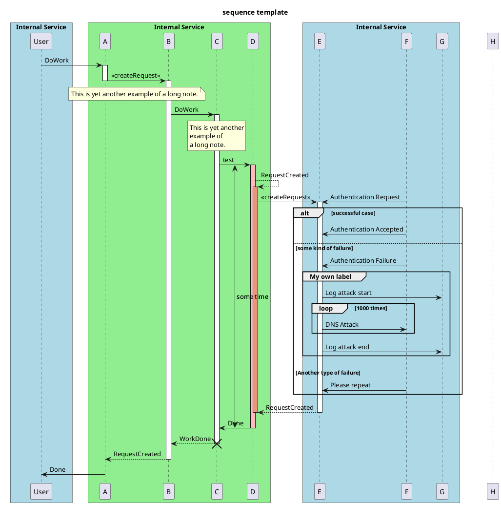
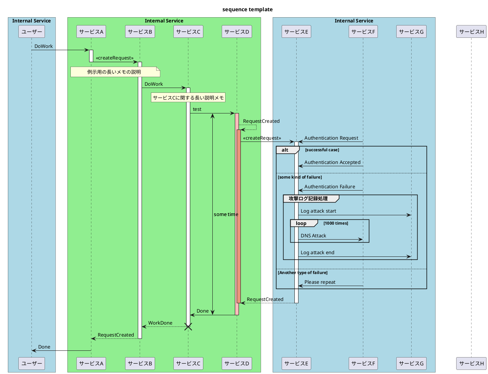

```plantuml
@startuml
!pragma teoz true
skinparam ParticipantPadding 20
skinparam BoxPadding 10

title
    sequence template
end title

box "Internal Service" #LightBlue
participant User
end box

box "Internal Service" #LightGreen
participant A
participant B
participant C
participant D
end box

box "Internal Service" #LightBlue
participant E
participant F
participant G
end box

participant H

User -> A: DoWork
activate A

A -> B: << createRequest >>
activate B
deactivate A

note over A, B
This is yet another example of a long note.
end note

B -> C: DoWork
activate C

rnote over C
This is yet another
example of
a long note.
end rnote

{start} C -> D: test
activate D #FFBBBB
D --> D: RequestCreated
activate D #DarkSalmon

D -> E: << createRequest >>
activate E

& F -> E: Authentication Request
alt successful case
    F -> E: Authentication Accepted
else some kind of failure
    F -> E: Authentication Failure
    group My own label
    E -> G : Log attack start
        loop 1000 times
            E -> F: DNS Attack
        end
    E -> G : Log attack end
    end
else Another type of failure
   F -> E: Please repeat
end

E --> D: RequestCreated

deactivate E
deactivate D

{end} D -> C: Done
deactivate D
{start} <-> {end} : some time

C --> B: WorkDone
destroy C

B --> A: RequestCreated
deactivate B

A -> User: Done
deactivate A

@enduml
```

```plantuml
@startuml
'=============================================
' ファイル書式設定
'=============================================
!pragma teoz true
skinparam ParticipantPadding 20
skinparam BoxPadding 10

'=============================================
' タイトル設定
'=============================================
title
    sequence template
end title

'=============================================
' 参加者（プレイヤー）の定義
'=============================================
' ユーザー（外部利用者）を配置
box "Internal Service" #LightBlue
  participant User as "ユーザー"
end box

' 内部サービスグループ（グリーン）: 主にA～Dが所属
box "Internal Service" #LightGreen
  participant A as "サービスA"
  participant B as "サービスB"
  participant C as "サービスC"
  participant D as "サービスD"
end box

' 内部サービスグループ（ブルー）: 主にE～Gが所属
box "Internal Service" #LightBlue
  participant E as "サービスE"
  participant F as "サービスF"
  participant G as "サービスG"
end box

' その他の参加者（必要に応じて利用）
participant H as "サービスH"

'=============================================
' シーケンス処理の流れ
'=============================================
' 1. ユーザーがサービスAに処理要求を送信
User -> A: DoWork
activate A

' 2. サービスAがサービスBにリクエスト作成依頼を送信
A -> B: << createRequest >>
activate B
deactivate A

' 3. サービスAとサービスB間で補足説明のメモを表示
note over A, B
  例示用の長いメモの説明
end note

' 4. サービスBがサービスCに処理依頼を送信
B -> C: DoWork
activate C

' 5. サービスCに対する右側の補足メモを表示
rnote over C
  サービスCに関する長い説明メモ
end rnote

' 6. サービスCがサービスDにテストメッセージを送信（開始ブロック）
{start} C -> D: test
' サービスDの初期アクティベーション（赤系のハイライト）
activate D #FFBBBB

' 7. サービスDが自己呼び出しでリクエスト作成（内部処理）
D --> D: RequestCreated
' アクティベーションの色を変更（処理進行中）
activate D #DarkSalmon

' 8. サービスDがサービスEにリクエスト作成依頼を送信
D -> E: << createRequest >>
activate E

' 9. サービスFがサービスEに認証要求を送信
& F -> E: Authentication Request

' 10. 認証処理の分岐
alt successful case
    ' 認証成功時：サービスFが認証成功を通知
    F -> E: Authentication Accepted
else some kind of failure
    ' 認証失敗時：サービスFが認証失敗を通知
    F -> E: Authentication Failure
    group 攻撃ログ記録処理
      ' 攻撃開始ログをサービスGに送信
      E -> G : Log attack start
      loop 1000 times
          ' DNS攻撃のシミュレーション（ループ処理）
          E -> F: DNS Attack
      end
      ' 攻撃終了ログをサービスGに送信
      E -> G : Log attack end
    end
else Another type of failure
   ' 別の失敗パターン：再試行要求
   F -> E: Please repeat
end

' 11. サービスEがリクエスト作成完了をサービスDに返却
E --> D: RequestCreated
deactivate E
deactivate D

' 12. サービスDが処理完了をサービスCに通知
{end} D -> C: Done
{start} <-> {end} : some time
deactivate D

' 13. サービスCが作業完了をサービスBに返却（終了後、サービスCは破棄）
C --> B: WorkDone
destroy C

' 14. サービスBがリクエスト作成完了をサービスAに返却
B --> A: RequestCreated
deactivate B

' 15. サービスAが処理完了をユーザーに返却
A -> User: Done
deactivate A

@enduml
```

